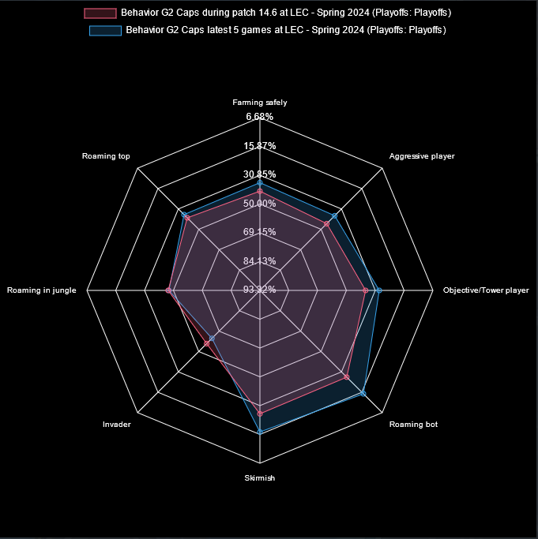

<!-- README.md -->

<h1 align="center" id="top">League of Legends Dashboard</h1>

<h3 align="center">This Repository is the source code of my personal project regarding LoL Analytics and Dashboarding. Don't hesitate to follow me on twitter <a href="https://twitter.com/Warock42">@Warock42</a>. This is still a work in progress</h3>

<h2 id="wave-about-this-repository">:wave: About This Repository</h2>
The Readme of this repository serves as a summary of all the tools that are available on the Dashboard, and API documentation. 

For more information about this repository and the author, see the following:

<!-- TABLE OF CONTENTS -->
<h2 id="book-table-of-contents">:books: Table of Contents</h2>

  
Table of Contents

  <ol>
    <li><a href="#wave-about-this-repository">About This Repository</a></li>
    <li><a href="#book-table-of-contents">Table of Contents</a></li>
    <li>
      <a href="#models">Data Mining/Machine Learning models</a>
      <ul>
        <li><a href="#behavior-analysis">Behavior Analysis</a></li>
        <li><a href="#draft-analysis">Draft Analysis (WIP)</a></li>
      </ul>
    </li>
    <li>
      <a href="#Api-documentation">API Documentation</a>
      <ul>
        <li><a href="#dataAnalysis">dataAnalysis</a></li>
        <li><a href="#Behavior">Behavior</a></li>
        <li><a href="#Behavior-models">Behavior Models</a></li>
        <li><a href="#Draft">Draft</a></li>
      </ul>
    </li>
  </ol>

<h2 id="models">:monocle_face: Data Mining/Machine Learning models</h2>
In order to perform data analysis I have used my knowledge in data science in order to retrieve relevant informations about players, games, drafts and so on... In this section I roughly explain what each models does.

<h3 id="behavior-analysis">:eye_speech_bubble: Behavior Analysis</h3>
The Behavior Analysis model is a data mining based on a Factor Analysis method. (Wikipedia page <a href="https://en.wikipedia.org/wiki/Factor_analysis">here</a>). Basically, given a set of observable variables (xi) we suppose that a set of underlying factors fk can be computed as a linear combinaison of the (xi)

$$
f_k = \sum_{i} λ_{i,k} x_{i,k}
$$

Where the λi,k are the "loadings" of our factors. These λi,k are computed in order to reduce the covariance between the xi,k. 

All in all we extract ingame statistics (Gold diff, damage per minute, etc.) in order to extract thos underlying factors. In order to give an interpretation of these factors we analyse the loading matrix and tell which factors is "using" which observable variables and then with basic knowledge about the game we give the factor a meaning. 

For more info you can read the article that I have written <a href="https://drive.google.com/file/d/1o6FcY_anyv7QE86N8dXMdxL2QZdNB26-/view?usp=sharing ">here</a>.

Then by normalising these values with a gaussian distribution we obtain the following results :

  

Here each of the axis are the value of the underlying factors that we have extracted. And the labels associated to it are done with the method described above

<h3 id="draft-analysis">:control_knobs: Draft Analysis (WIP)</h3>

<h2 id="Api-documentation">:open_book: API documentation</h2>

<h3 id="dataAnalysis">:arrow_forward: dataAnalysis</h3>
<h3 id="Behavior">:arrow_forward: Behavior</h3>
<h3 id="Behavior-modelos">:arrow_forward: Behavior Models</h3>
<h3 id="Draft">:arrow_forward: Draft</h3>